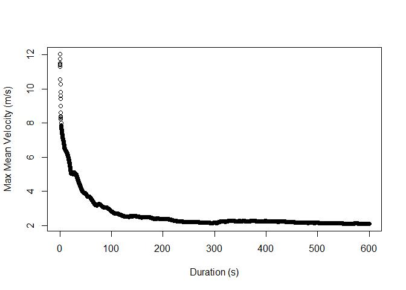
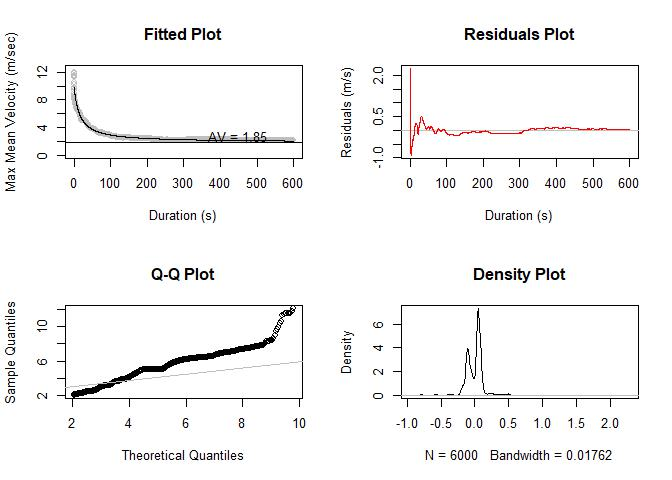
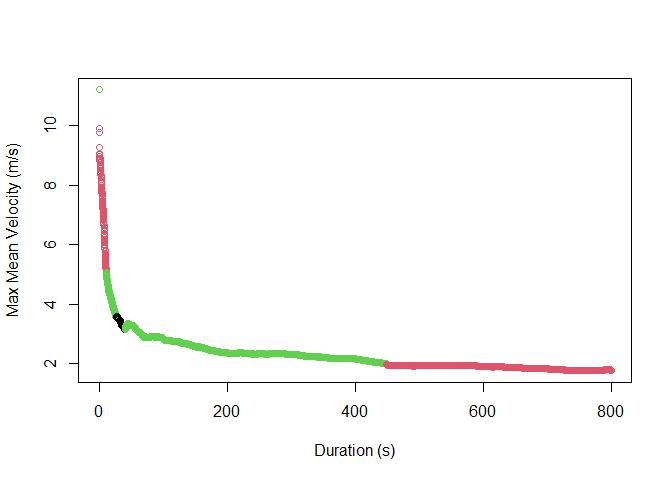
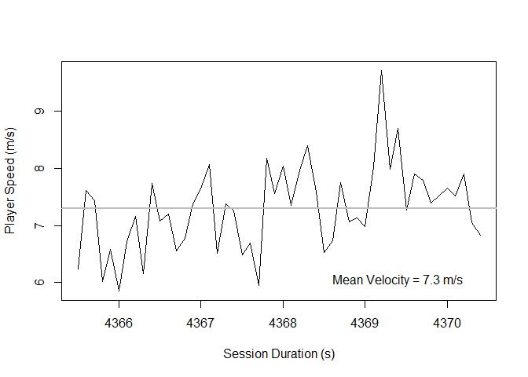

# critspeed: modelling critical speed from player tracking data in R

Install the package by copying and running the following in your
console:

`devtools::install_github("critspeed")`

## Working with the Package

### Load the Package

``` r
library(critspeed)
```

### Data Sets

The package includes three data sets:

- sessionRaw: Fabricated game data
- sessionMaxMeanSpeed: Maximal mean speed
- sessionMaxMedianSpeed: Maximal median speed

### Functions

**`critspeed()`**

The primary function of the critspeed package is `critspeed()` which
takes a player’s speed vector and returns either their max mean or
median speed from 0.1 to a given duration (default = 600 s).

This function can take up to 1 minute, depending on the size of your
data set.

``` r
mmv.sample <- critspeed(player.speed = sessionRaw$speed, 
          dur = 600,
          sample.rate = 10,
          method = "mean")

head(mmv.sample)
```

    ##   duration max.mean.speed
    ## 1      0.1       12.02680
    ## 2      0.2       11.75083
    ## 3      0.3       11.50639
    ## 4      0.4       11.43256
    ## 5      0.5       11.43511
    ## 6      0.6       11.42833

This data can then be visualized using a simple `plot()` function.

``` r
plot(max.mean.speed ~ duration, 
     data = mmv.sample,
     xlab = "Duration (s)",
     ylab = "Max Mean Velocity (m/s)")
```



------------------------------------------------------------------------

**`model.parameters()`**

The critspeed package currently supports the following models: 
* Two parameter
* Three parameter
* Five parameter
* Omni-domain velocity-duration

The package will fit the model by optimizing for the minimum RSE value
to the `data.frame` generated from the `critspeed()` function and
returns (when applicable): \* Critical speed \* Anaerobic capacity (D’)
\* Max speed

Users must note that the default minum duration for the two parameter
model is set to 120 s. This was decided to improve model fit. Users can
input their own minimum duration using the argument `cv.2`.

``` r
model.parameters(mmv.sample)
```

    ##          model crit.speed   d.prime max.speed       rss        rse        AIC
    ## 1:   two.param   2.004295  69.60702        NA  11.17780 0.04826171 -15476.136
    ## 2: three.param   1.853715 123.39202  9.841898 128.58541 0.14642958  -6022.266
    ## 3:  five.param   2.117170        NA 11.126993  74.84174 0.11173194  -9265.571
    ## 4:        omvd   1.935855  91.84834  9.031137 131.70029 0.14819254  -5878.653
    ##           BIC          a        b        f
    ## 1: -15456.706         NA       NA       NA
    ## 2:  -5995.468         NA       NA       NA
    ## 3:  -9225.374 -0.5553556 12.94493 253.7724
    ## 4:  -5851.855         NA       NA       NA

------------------------------------------------------------------------

**`fitted.model()`**

`fitted.model()` returns both the fitted data and their residuals. This
function takes on takes on the `data.frame` that was generated from the
`critspeed()` function.

The two parameter model will display `NA` for the first 120 s of data
unless over-written by using the `cv.2` argument.

``` r
mmv.fitted <- fitted.model(mmv.sample)

head(mmv.fitted)
```

    ##   duration log.duration max.speed two.param.fit two.param.resid three.param.fit
    ## 1      0.1   -1.0000000  12.02680            NA              NA        9.790517
    ## 2      0.2   -0.6989700  11.75083            NA              NA        9.739792
    ## 3      0.3   -0.5228787  11.50639            NA              NA        9.689712
    ## 4      0.4   -0.3979400  11.43256            NA              NA        9.640263
    ## 5      0.5   -0.3010300  11.43511            NA              NA        9.591435
    ## 6      0.6   -0.2218487  11.42833            NA              NA        9.543215
    ##   three.param.resid five.param.fit five.param.resid omvd.fit omvd.resid
    ## 1          2.236281      10.659179         1.367618 9.003802   3.022996
    ## 2          2.011040      10.448017         1.302815 8.976607   2.774225
    ## 3          1.816674      10.284826         1.221559 8.949552   2.556834
    ## 4          1.792297      10.147179         1.285381 8.922635   2.509925
    ## 5          1.843675      10.026163         1.408947 8.895856   2.539253
    ## 6          1.885111       9.917129         1.511197 8.869215   2.559111

The data can then be plotted using the `plot.model()` function.

------------------------------------------------------------------------

**`plot.model()`**

Users can visualize model fits using the `plot.model()` function and by
indicating which model they want to fit. The example below fits the
three parameter model to the `data.frame` that was generated from the
`critspeed()` function.

``` r
plot.model(mmv.sample, 
           model = "three.param")
```



To return just the fitted model (Fitted Plot), users can define the
`output` argument as `"fit"`.

``` r
plot.model(mmv.sample, 
           model = "three.param",
           output = "fit")
```



------------------------------------------------------------------------

**`compile()`**

When working with multiple sessions, users may be interested in tracking
changes in a player’s critical speed. `compile()` allows users to input
multiple vectors that contain the player’s speed data and will return
their greatest maximal mean or median speeds. The function will also
index which session the values were pulled (`.id` variable) in
accordance with the order of the vectors.

The example below utilize maximal mean velocity data from four games and
practices in Men’s soccer. The data are in the same format as the data
sets returned by the `critspeed()` function.

``` r
mmv.compile <- compile(session1, 
                       session2, 
                       session3, 
                       session4)

head(mmv.compile)
```

    ##   duration max.mean.speed .id
    ## 1      0.1      11.206960   3
    ## 2      0.2       9.918029   2
    ## 3      0.3       9.788142   2
    ## 4      0.4       9.266569   2
    ## 5      0.5       9.087284   2
    ## 6      0.6       9.022678   2

Users can visualize which observations were pulled from their respective
data sets by plotting them as follows:

``` r
plot(max.mean.speed ~ duration, mmv.compile,
     col = mmv.compile$.id,
     xlab = "Duration (s)",
     ylab = "Max Mean Velocity (m/s)")
```



### Considerations for Advanced Users

The following function requires some proficiency in R because of how the
arguments are set-up. If the functions were written to take-on the
`data.frame` that was generated from the `critspeed()` function, the
user’s options would be limited.

**`speed.observations()`**

The `speed.observations()` function returns a data set that contains the
speed values from the session from which the maximal mean or maximal
median values were pulled for a given duration. The function’s primary
arguments are `player.speed` and `...` which take on one or more vectors
that contain a player’s speed. As with `compile()`, the function will
return the index which corresponds to the vector that contains the
observations.

Users must note that the data are vectors from the tracking data and not
the maximal mean or maximal median speed values that are generated from
the `critspeed()` function.

The example below utilizes the `sessionRaw` data but can take on
multiple vectors. The output from the example below will correspond to
the speed observations that make up the greatest maximal mean velocity
for 5 s.

Please note that although the `method` argument can take-on `"median"`,
it is not currently implemented.

``` r
mmv.observations <- speed.observations(sessionRaw$speed, 
                   dur = 5, 
                   sample.rate = 10,
                   method = "mean")

head(mmv.observations)
```

    ##   index   time player.speed
    ## 1     1 4365.5     6.242273
    ## 2     1 4365.6     7.610624
    ## 3     1 4365.7     7.436770
    ## 4     1 4365.8     6.019798
    ## 5     1 4365.9     6.587517
    ## 6     1 4366.0     5.847924

These data can be visualized using the `plot()` function. The maximal
mean speed for the player at 5 s is 7.3 m/s and is visualized on the
plot by the horizontal grey line.

``` r
plot(player.speed ~ time, 
     mmv.observations, 
     "l",
     xlab = "Session Duration (s)",
     ylab = "Player Speed (m/s)")
abline(h = mean(mmv.observations$player.speed),
       col = "grey",
       lwd = 2)
text(x = max(mmv.observations$time - 1), 
     y = mean(mmv.observations$player.speed) - 1.25,
     label = paste0("Mean Velocity = ", 
                    round(
                      mean(mmv.observations$player.speed),
                      2),
                    " m/s"
                    )
     )
```


### Future Directions

The package will soon support the following models:

- Extended omni-domain velocity-duration
- Power law
- Exponential model
- Richard’s logistic 5 parameter  
- Generalized logistic 4 parameter  
- Logistic 3 parameter  
- Quintic polynomial  
- Bi-exponential with 5 parameters  
- Gompertz’ logistic 4 parameter  
- Decaying exponential 3 parameter

and will allow users to model and plot a player’s anaerobic balance (D’
balance) over the course of a session.

### Technical Notes

This package is lightweight and currently has three dependencies: \*
`data.table` \* `Rfast` \* `minpack.lm`

Users should note that `data.table` and `Rfast` are written with a C++
back-end and can require large amounts of system resources. These
packages were chosen because they can process the data quickly and
efficiently.

Please email Aaron at <aaron@midsprint.io> for technical issues or
suggestions.
